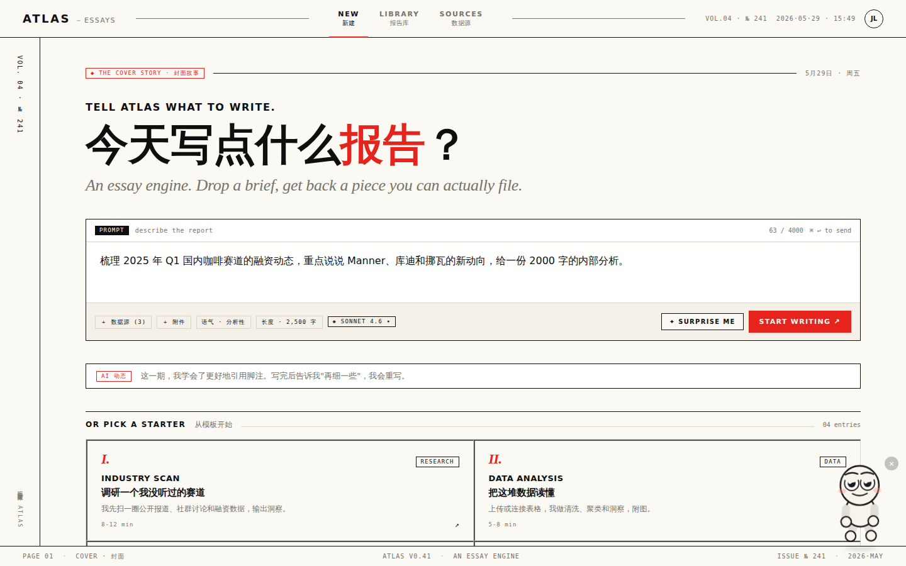

# Atlas Report Agent

**AI-powered, browser-based report generation tool.**

[](https://lvvvvvvvvvvvvvvvvv.github.io/atlas-essay/)
[](docs/CHANGELOG.md)
[](https://react.dev)
[](https://vitejs.dev)
[](LICENSE)

---

**AI 驱动的浏览器端报告生成工具。**

[](https://lvvvvvvvvvvvvvvvvv.github.io/atlas-essay/)
[](docs/CHANGELOG.md)

---



---

## Table of Contents

- [About](#about)
- [Features](#features)
- [Project Structure](#project-structure)
- [Getting Started](#getting-started)
- [Deployment](#deployment)
- [Documentation](#documentation)
- [Tech Stack](#tech-stack)
- [License](#license)

---

## About

Atlas Report Agent is a fully client-side web application that generates structured, long-form reports on any topic using large language models. It supports multiple AI providers, exports to various formats, and stores all data locally in the browser — no server or account required.

Configure your own API key, pick a model, enter a topic, and receive a streaming Markdown report in seconds. Everything — saved reports, settings, permissions — lives in `localStorage`.

---

## 简介

Atlas Report Agent 是一款纯客户端 Web 应用，支持调用主流大语言模型，针对任意主题生成结构化长篇报告。支持多 AI 提供商、多格式导出，所有数据本地存储于浏览器，无需服务器或账号。

配置 API Key、选择模型、输入主题，即可获得流式输出的 Markdown 报告。已保存报告、设置项、权限配置均存储在 `localStorage` 中。

---

## Features

- **Multi-model support** — GPT-4o, Claude 3.7 Sonnet, Gemini 2.0 Flash, DeepSeek V3/R1, and more; add any OpenAI-compatible custom model
- **Streaming generation** — real-time Markdown rendering as the model outputs
- **Multi-format export** — JSON, Markdown, PDF, DOCX, Notion, shareable link; batch export with merge or split modes
- **Report library** — save, favourite, search, filter and bulk-delete reports
- **Permission roles** — admin / editor / viewer with a configurable permission matrix
- **Daily AI news** — Hacker News AI headlines fetched daily, auto-translated to Chinese, rotating every 5 seconds
- **Dark mode & themes** — light/dark toggle, custom accent colour
- **Demo mode** — works without an API key using a fixed sample report

---

## 主要功能

- **多模型支持** — GPT-4o、Claude 3.7 Sonnet、Gemini 2.0 Flash、DeepSeek V3/R1 等；可添加任意兼容 OpenAI 格式的自定义模型
- **流式生成** — 模型输出时实时渲染 Markdown
- **多格式导出** — JSON、Markdown、PDF、DOCX、Notion、分享链接；批量导出支持合并或分别导出
- **报告库** — 保存、收藏、搜索、筛选、批量删除报告
- **权限角色** — admin / editor / viewer 三级角色，可视化权限矩阵，单元格点击即时生效
- **每日 AI 动态** — 每天从 Hacker News 抓取 AI 新闻，自动翻译为中文，每 5 秒轮播
- **暗色模式与主题** — 亮/暗切换，自定义主题色
- **演示模式** — 无 API Key 时使用固定示例报告，功能完整可体验

---

## Project Structure

```
atlas-essay/
├── .github/
│   └── workflows/
│       └── deploy.yml        # CI/CD: build & deploy to gh-pages on push to main
├── archive/
│   └── Report Agent · Essay.html   # Legacy single-file version (pre-Vite)
├── chats/
│   └── chat1.md              # Claude Design chat transcript from initial design phase
├── docs/
│   ├── CHANGELOG.md          # Version history
│   ├── 功能清单.md            # Full feature list (Chinese)
│   └── 操作手册.md            # User operation manual (Chinese)
├── project/
│   ├── lib/                  # Original wireframe JSX components
│   ├── screenshots/          # Early design screenshots
│   ├── uploads/              # Reference images from design phase
│   └── Report Agent · Essay.html   # Initial design prototype
├── prototypes/
│   ├── pet-actions.html      # Pet character interaction prototype
│   ├── pet-live.html         # Pet live animation prototype
│   ├── pet-options.html      # Pet options prototype
│   ├── pet-preview.html      # Pet preview prototype
│   ├── pet-screenshot.js     # Screenshot utility for prototypes
│   └── *.png                 # Prototype screenshots
├── public/
│   └── index.html            # Vite entry HTML (Google Fonts, root div)
├── scripts/
│   └── deploy.sh             # Manual deploy script (legacy)
├── src/
│   ├── App.jsx               # Main application — all components and logic
│   ├── main.jsx              # React entry point (ReactDOM.createRoot)
│   └── styles/
│       └── globals.css       # Global CSS and keyframe animations
├── .gitignore                # Excludes node_modules/, dist/
├── .nojekyll                 # Disables GitHub Pages Jekyll processing
├── index.html                # Vite entry point (must remain at root)
├── package.json              # Node.js project manifest and scripts
├── package-lock.json         # Dependency lock file
├── README.md                 # This file
└── vite.config.js            # Vite build config (React + singlefile output)
```

---

## 项目结构

```
atlas-essay/
├── .github/
│   └── workflows/
│       └── deploy.yml        # CI/CD：推送 main 后自动构建并部署到 gh-pages
├── archive/
│   └── Report Agent · Essay.html   # 遗留单文件版（Vite 迁移前）
├── chats/
│   └── chat1.md              # 初始设计阶段 Claude Design 对话记录
├── docs/
│   ├── CHANGELOG.md          # 版本更新日志
│   ├── 功能清单.md            # 完整功能说明文档
│   └── 操作手册.md            # 用户操作手册
├── project/
│   ├── lib/                  # 早期 wireframe JSX 组件
│   ├── screenshots/          # 早期设计截图
│   ├── uploads/              # 设计阶段参考图片
│   └── Report Agent · Essay.html   # 初始设计原型
├── prototypes/
│   ├── pet-actions.html      # 宠物角色交互原型
│   ├── pet-live.html         # 宠物动画效果原型
│   ├── pet-options.html      # 宠物参数配置原型
│   ├── pet-preview.html      # 宠物预览原型
│   ├── pet-screenshot.js     # 原型截图工具脚本
│   └── *.png                 # 各原型截图
├── public/
│   └── index.html            # Vite 入口 HTML（Google Fonts、root div）
├── scripts/
│   └── deploy.sh             # 手动部署脚本（历史遗留）
├── src/
│   ├── App.jsx               # 主应用组件（所有功能逻辑）
│   ├── main.jsx              # React 入口（ReactDOM.createRoot）
│   └── styles/
│       └── globals.css       # 全局样式与关键帧动画
├── .gitignore                # 排除 node_modules/、dist/
├── .nojekyll                 # 禁用 GitHub Pages Jekyll 处理
├── index.html                # Vite 入口文件（必须保留在根目录）
├── package.json              # Node.js 项目配置与脚本
├── package-lock.json         # 依赖锁定文件
├── README.md                 # 本文件
└── vite.config.js            # Vite 构建配置（React + 单文件输出）
```

---

## Getting Started

### Prerequisites

- Node.js 18+
- An API key from any supported provider (OpenAI, Anthropic, Google, DeepSeek, etc.)

### Install

```bash
git clone https://github.com/Lvvvvvvvvvvvvvvvvv/atlas-essay.git
cd atlas-essay
npm install
```

### Development

```bash
npm run dev
```

Open `http://localhost:5173` in your browser.

### Build

```bash
npm run build
```

Outputs a single self-contained `dist/index.html` with all CSS and JS inlined.

---

## 快速开始

### 环境要求

- Node.js 18+
- 任意受支持提供商的 API Key（OpenAI、Anthropic、Google、DeepSeek 等）

### 安装

```bash
git clone https://github.com/Lvvvvvvvvvvvvvvvvv/atlas-essay.git
cd atlas-essay
npm install
```

### 开发模式

```bash
npm run dev
```

在浏览器中打开 `http://localhost:5173`。

### 构建

```bash
npm run build
```

输出单一自包含文件 `dist/index.html`，所有 CSS 与 JS 已内联。

---

## Deployment

This project uses GitHub Actions for automated deployment.

Every push to `main` triggers the workflow in `.github/workflows/deploy.yml`:

1. Checkout repository
2. Install Node.js 20
3. Run `npm install && npm run build`
4. Copy `docs/` into `dist/`
5. Deploy `dist/` to the `gh-pages` branch via `peaceiris/actions-gh-pages`

GitHub Pages serves the `gh-pages` branch at:
`https://lvvvvvvvvvvvvvvvvv.github.io/atlas-essay/`

---

## 部署说明

本项目使用 GitHub Actions 自动部署。

每次推送到 `main` 分支时，`.github/workflows/deploy.yml` 工作流自动执行：

1. 拉取仓库代码
2. 安装 Node.js 20
3. 执行 `npm install && npm run build`
4. 将 `docs/` 复制到 `dist/`
5. 通过 `peaceiris/actions-gh-pages` 将 `dist/` 部署到 `gh-pages` 分支

GitHub Pages 从 `gh-pages` 分支提供服务，访问地址：
`https://lvvvvvvvvvvvvvvvvv.github.io/atlas-essay/`

---

## Documentation

| File | Description |
|------|-------------|
| [CHANGELOG.md](docs/CHANGELOG.md) | Version history from v1.0.0 to present |
| [功能清单.md](docs/功能清单.md) | Complete feature list with module breakdown |
| [操作手册.md](docs/操作手册.md) | Step-by-step user manual with FAQ |

---

## 文档

| 文件 | 说明 |
|------|------|
| [CHANGELOG.md](docs/CHANGELOG.md) | v1.0.0 至今的版本更新历史 |
| [功能清单.md](docs/功能清单.md) | 按模块划分的完整功能说明 |
| [操作手册.md](docs/操作手册.md) | 分步骤操作指南与常见问题解答 |

---

## Tech Stack

| Layer | Technology |
|-------|-----------|
| UI Framework | React 18 |
| Build Tool | Vite 5 |
| Output Format | Single-file HTML via `vite-plugin-singlefile` |
| Styling | Plain CSS (no framework) |
| State / Storage | React hooks + `localStorage` |
| AI Integration | OpenAI-compatible REST API |
| CI/CD | GitHub Actions + GitHub Pages |

---

## 技术栈

| 层次 | 技术 |
|------|------|
| UI 框架 | React 18 |
| 构建工具 | Vite 5 |
| 输出格式 | 单文件 HTML（vite-plugin-singlefile） |
| 样式 | 原生 CSS（无 CSS 框架） |
| 状态与存储 | React Hooks + `localStorage` |
| AI 接入 | 兼容 OpenAI 格式的 REST API |
| CI/CD | GitHub Actions + GitHub Pages |

---

## License

MIT © 2026 Atlas
