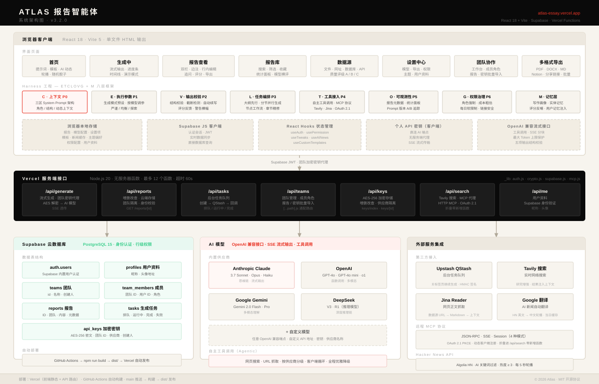

# Atlas Report Agent

**AI-powered report generation platform — full-stack, serverless, single-file frontend.**

[](https://atlas-essay.vercel.app/)
[](docs/CHANGELOG.md)
[](https://react.dev)
[](https://vitejs.dev)
[](LICENSE)

**AI 驱动的报告生成平台 — 全栈、Serverless、单文件前端。**

> **在线体验：** https://atlas-essay.vercel.app/ — 注册登录后即可用内置模型直接生成报告，无需配置任何 API Key。


---

## 简介

Atlas Report Agent 是一个面向垂类数据分析场景的 AI 报告生成平台。用户输入一句话需求，系统调用大语言模型流式生成结构化长篇报告——含标题、章节目录、正文、带来源的引用列表，并支持多格式导出、云端同步与团队协作。

产品形态上做了一个少见的取舍：**前端构建产物是一个完全自包含的单 HTML 文件**（所有 JS/CSS 内联，gzip 后约 320KB），加载即用、无静态资源依赖；而账号体系、密钥托管、后台任务等需要可信执行环境的能力全部下沉到 Serverless 函数层。两者组合出「分发像静态页一样轻，能力像全栈应用一样全」的体验。

---

## 系统架构



三层架构，职责严格分离：

```
┌─────────────────────────────────────────────────────┐
│  浏览器层 · React 18 SPA（单文件构建）                  │
│  流式渲染 / 报告库 / 团队面板 / 工作流画布 / 多格式导出   │
├─────────────────────────────────────────────────────┤
│  Serverless API 层 · Vercel Functions                │
│  generate（模型代理）/ keys（密钥托管）/ reports（云同步）│
│  teams（协作）/ tasks（后台任务）/ search（搜索增强）     │
├─────────────────────────────────────────────────────┤
│  数据与服务层                                          │
│  Supabase（PostgreSQL + Auth + RLS）                  │
│  Upstash QStash（后台任务队列）· Tavily（联网搜索）      │
└─────────────────────────────────────────────────────┘
```

### 架构层亮点

- **凭证零暴露的模型代理**：浏览器从不直接持有服务端密钥。生成请求携带用户会话 token 到 `/api/generate`，函数侧完成鉴权、取密钥、调上游、把 SSE 流原样透传回浏览器，首字延迟接近直连。
- **三级密钥解析**：代理按「个人密钥 → 团队密钥 → 系统内置共享密钥」顺序解析，分别覆盖个人使用、团队共享、访客免配置三种场景。密钥以 AES-256 加密落库，环境变量仅存系统级共享密钥。
- **上游地址自动归一化**：不同模型服务商的接口地址风格各异（版本段缺失、多余路径后缀、空白字符），代理层统一容错修正，管理员配置时无需关心格式细节。
- **会话与数据隔离**：Supabase Row Level Security 保证报告、密钥、团队数据按用户/团队隔离，前端无法越权读取。
- **关 Tab 不中断的后台生成**：长报告任务可交给 QStash 队列驱动的后台函数执行，进度持久化在数据库，用户随时回来取结果。

### 技术层亮点

- **单文件构建**：Vite + `vite-plugin-singlefile` 将整个 SPA 打成一个 `dist/index.html`，无 CDN、无分包、无静态资源 404 问题，任何能伺服 HTML 的地方都能部署前端。
- **流式体验**：SSE 增量渲染，正文逐段出现，同时侧栏实时展示生成进度时间线（连接 / 各章节完成 / 总字数）。
- **推理类模型适配**：对会输出长思考过程的推理模型，代理层自动关闭思考模式，避免思考 token 耗尽配额导致正文为空。
- **报告质量校验**：生成完成后自动校验结构完整性（标题、章节数、字数达标率、截断检测、未闭合代码块），异常时给出明确提示，截断可自动续写一次。
- **Agentic 研究增强**：支持联网搜索（Tavily）、网页抓取、工具调用循环（agentic tool use）与 HTTP MCP / OAuth 2.1 MCP 服务接入，为报告注入实时资料与可溯源引用。
- **模型评测体系**：内置 Benchmark 模块，可对多个模型跑同题横评，按结构、引用、字数达标等客观维度打分排名。

---

## 主要功能

- **多模型接入** — 任意兼容 OpenAI 格式的模型服务均可添加；内置模型登录即用，无需配置
- **流式生成** — 实时 Markdown 渲染 + 生成进度时间线
- **报告库与云同步** — 保存、收藏、搜索、筛选；登录后多端同步
- **团队协作** — 创建团队、共享密钥与知识库、成员权限管理
- **多格式导出** — PDF / DOCX / Markdown / JSON / Notion / 分享链接，支持批量导出
- **后台任务** — 长任务后台执行，关闭页面不中断
- **研究增强** — 联网搜索、网页引用、MCP 工具接入
- **模型评测** — 多模型同题横评与历史排行榜
- **节点式工作流**（开发中）— 可视化编排报告生成流程

---

## 项目结构

```
atlas-essay/
├── api/                      # Vercel Serverless Functions
│   ├── generate.js           # 模型代理：鉴权 → 三级密钥解析 → SSE 透传
│   ├── keys.js               # API Key 加密托管（AES-256）
│   ├── reports.js            # 报告云同步
│   ├── teams.js              # 团队与成员管理
│   ├── tasks.js              # 后台生成任务（QStash）
│   └── search.js             # 联网搜索增强
├── src/
│   ├── App.jsx               # 主应用
│   ├── components/           # 拆分组件（登录、工作流画布等）
│   ├── hooks/                # useAuth / useWorkflow 等
│   ├── lib/                  # streamReport / 解析器 / 常量
│   └── styles/globals.css
├── docs/
│   ├── architecture.svg      # 系统架构图
│   ├── 业务流程图.svg          # 三泳道业务流程图
│   ├── 功能清单.md            # 12 模块功能全景
│   ├── 操作手册.md            # 用户旅程式操作指南
│   ├── 测试报告_2026-06-11.md # MVP 端到端测试报告
│   └── CHANGELOG.md          # 版本历史
├── index.html                # Vite 入口
├── vite.config.js            # React + singlefile 构建配置
└── package.json
```

---

## 快速开始

### 直接使用

打开 https://atlas-essay.vercel.app/ ，注册并完成邮箱验证后，使用默认的内置模型即可生成报告；也可在「设置 → 模型」中配置自己的 API Key 使用其他模型。

### 本地开发

```bash
git clone https://github.com/Lvvvvvvvvvvvvvvvvv/atlas-essay.git
cd atlas-essay
npm install
npm run dev        # http://localhost:5173
npm run build      # 输出单文件 dist/index.html
```

> 本地开发模式下仅前端能力可用；账号、云同步、内置模型等依赖 Vercel 函数层与相应环境变量（Supabase、共享密钥等）。

### 部署

推送 `main` 分支后 Vercel 自动构建部署（前端静态产物 + `api/` 函数）。需要配置的环境变量见函数源码顶部注释，核心包括 Supabase 连接信息、密钥加密主密钥，以及可选的系统共享密钥与其接口地址。

---

## 文档

| 文件 | 说明 |
|------|------|
| [CHANGELOG.md](docs/CHANGELOG.md) | 版本更新历史 |
| [功能清单.md](docs/功能清单.md) | 按模块划分的完整功能说明 |
| [操作手册.md](docs/操作手册.md) | 按用户旅程编排的操作指南 |
| [测试报告_2026-06-11.md](docs/测试报告_2026-06-11.md) | MVP 端到端测试报告 |
| [architecture.svg](docs/architecture.svg) | 系统架构图 |
| [业务流程图.svg](docs/业务流程图.svg) | 业务流程图（认证 / 生成 / 协作三泳道） |

---

## 技术栈

| 层次 | 技术 | 选型理由 |
|------|------|---------|
| UI 框架 | React 18 | Hooks 全函数式组件，无类组件 |
| 构建 | Vite 5 + vite-plugin-singlefile | 单文件产物，零静态资源依赖 |
| 样式 | 原生 CSS | 无框架运行时开销，主题用 CSS 变量 |
| API 层 | Vercel Serverless Functions | 按需冷启动，零运维 |
| 数据库与认证 | Supabase（PostgreSQL + Auth + RLS） | 行级安全策略做多租户隔离 |
| 任务队列 | Upstash QStash | 后台生成任务的可靠投递 |
| 搜索增强 | Tavily API | 报告引用的实时资料来源 |
| AI 接入 | OpenAI 兼容 REST API + SSE | 一套协议适配所有主流模型服务 |

---

## License

MIT © 2026 Atlas
